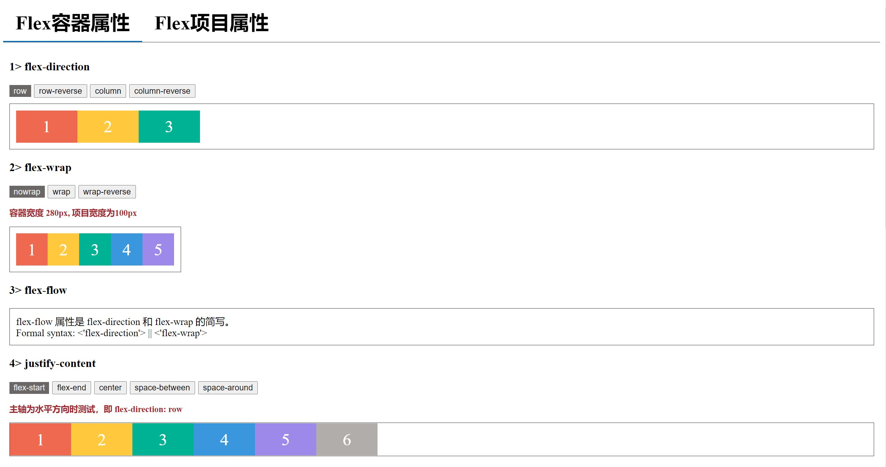

# Flex-demo

### run
* download the repo;
* run the index.html;
`you don't need to install any packages. It is convenient to see page.`

### page

### details
The page is divided into two parts. You can click each tab to view its props. Each prop provide dynamic button, so you can view the page effect in real time.

### document
Here is a document for flex. The link is [Flex布局](https://www.jianshu.com/p/a74b58fe37d6).  I think it will be useful.
